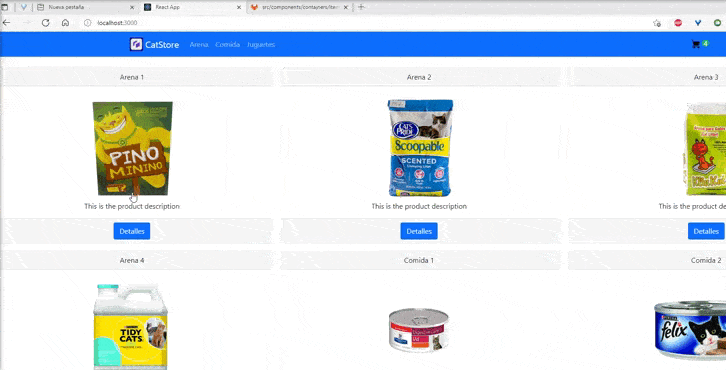

## proyecto de e-commerce para curso de react de Coder House

Simula una tienda de insumos para gatos en un SPA (Single Page Application), mediante la tecnologia React-Route. 

Los productos se almacenan en una Mock de productos , se identifican de forma unica por un id y por el nombre de categoria.
El id unico permite ver el detalle de cada producto de forma individual.
El nombre de categoria permite agrupar los productos y generar los grupos de navegacion.

## Clonar el proyecto e instalar librerias con

### `npm install`

## Para correr el proyecto

### `npm start`

# Librerias Extras :

-   [react-bootstrap](https://react-bootstrap.github.io/) : para agilizar el proceso de maquetado.
-   [react-router-dom](https://reactrouter.com//) : para manejar el routing de los productos e integracion dentro de la spa .
-   [firebase](https://console.firebase.google.com/): para automatizar la api de la spa

